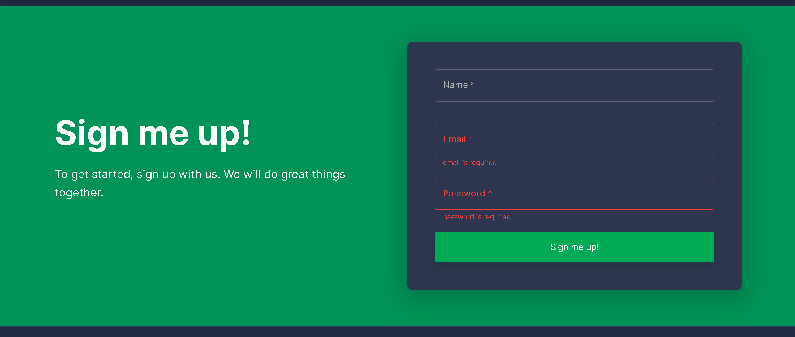

# 🚀 Web Fotovoltaica

This project was created with template is built in React and is based on Material-UI design. It is mix of JavaScript and TypeScript files. It is the front end of the service and communicates via REST endpoints back to the microservices.

# Getting started

- Install Node v14 (newer versions will not work)
- Install dependencies: `yarn install`
- Start the server: `yarn start`

When the page loads, you can create a new account by scrolling down to the "Sign me up!" section.

If you run into any problems in the workflow, please post an issue and we will respond ASAP.

## Quick start

- Install dependencies: `yarn install`
- Start the server: `yarn start`
- Build on production: `yarn build`
